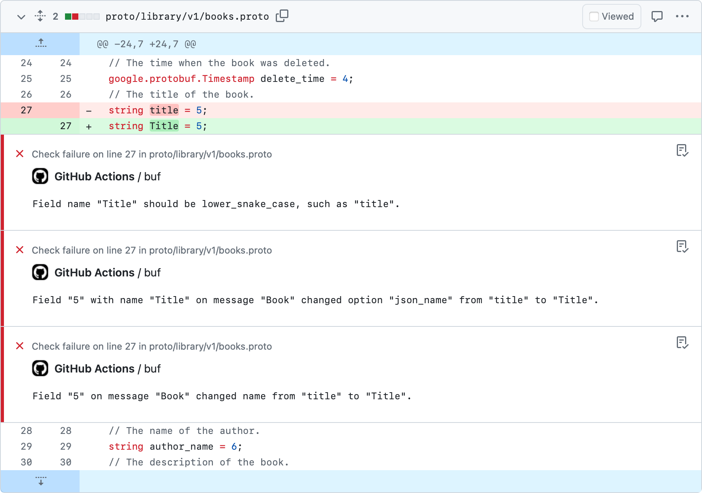

# buf-action

[][ci]
[][slack]

This GitHub action makes it easy to run [`buf`][buf] within a workflow to check for
[build](https://buf.build/docs/reference/cli/buf/build),
[lint](https://buf.build/docs/lint/overview),
[format](https://buf.build/docs/format/style),
and [breaking change](https://buf.build/docs/breaking/overview) errors,
as well as to automatically [publish schema changes](https://buf.build/docs/bsr/module/publish) to the [Buf Schema Registry (BSR)](https://buf.build/product/bsr).



## Usage

To use this action with the recommended default behavior, create a new `.github/workflows/buf-ci.yaml` file in your repository with the following content:

```yaml
name: Buf CI
on:
  push:
  pull_request:
    types: [opened, synchronize, reopened, labeled, unlabeled]
  delete:
permissions:
  contents: read
  pull-requests: write
jobs:
  buf:
    runs-on: ubuntu-latest
    steps:
      - uses: actions/checkout@v7
      - uses: bufbuild/buf-action@v1
        with:
          token: ${{ secrets.BUF_TOKEN }}
```

This default configuration:

- Uses `buf push` to [push named modules to the BSR](https://buf.build/docs/bsr/module/publish/) when you push a Git commit, tag, or branch to GitHub.
- Runs all Buf checks (`build`, `lint`, `format`, and `breaking`), posting a [summary comment](https://buf.build/docs/bsr/ci-cd/github-actions/#configure-summary-comment) for any pull request.
- Archives corresponding [labels](https://buf.build/docs/bsr/commits-labels/#labels) in the BSR when you delete a Git branch or tag.

## Authenticating without a token

Instead of storing a long-lived BSR token as a repository secret, the workflow can authenticate as a [bot user](https://buf.build/docs/bsr/admin/instance/bot-users/) with its own GitHub identity.
GitHub signs an [OpenID Connect token](https://docs.github.com/en/actions/concepts/security/openid-connect) that says which repository, workflow, and ref is running.
The BSR checks that against a trust credential you configure on the bot user and hands back a short-lived token.
The action revokes that token when the job finishes.

Set `bot_username` instead of [`token`](https://buf.build/docs/bsr/authentication/), and grant the job `id-token: write` so GitHub will sign a token for it:

```yaml
permissions:
  contents: read
  pull-requests: write
  id-token: write # Required to request the GitHub OIDC token.
jobs:
  buf:
    runs-on: ubuntu-latest
    steps:
      - uses: actions/checkout@v7
      - uses: bufbuild/buf-action@v1
        with:
          # The bot user to authenticate as.
          bot_username: my-bot-user
          # Defaults to buf.build; set it for a self-hosted BSR.
          domain: bsr.acme.com
```

In order for the workflow to be allowed to authenticate, a server admin must create a trust credential for the bot user under **Admin → Bot users → _user_ → Trust credentials** in the BSR.

## Documentation

For comprehensive configuration options, advanced workflows, and detailed examples, see the [Buf GitHub Action Documentation](https://buf.build/docs/bsr/ci-cd/github-actions).

## Examples

Check out the [examples](examples) directory for various workflow configurations.

## Migrating from individual Buf actions

If you're currently using any of our individual actions
([buf-setup-action][buf-setup], [buf-breaking-action][buf-breaking], [buf-lint-action][buf-lint], [buf-push-action][buf-push]),
we recommend migrating to this consolidated action that has additional capabilities. Benefits to migrating include:
- Less configuration and setup, with built-in best practices.
- Enhanced integration with Git data when pushing to the BSR.
- Status comments on pull requests.
- Easy configuration for custom behavior.

See the [migration guide](MIGRATION.md) for more information.

## Debugging

To debug the action, rerun the workflow with debug logging enabled.
This will run all buf commands with the `--debug` flag.
See the [re-run jobs with debug logging](https://github.blog/changelog/2022-05-24-github-actions-re-run-jobs-with-debug-logging/) for more information.

With debug logging enabled, [authenticating without a token](#authenticating-without-a-token) also logs the claims GitHub put in the OIDC token, the registry's HTTP status and request ID for each attempt, and the lifetime of the minted token.
The tokens themselves are registered as secrets and never logged.

### Troubleshooting authentication without a token

| Message                                             | Cause                                                                                                                                                                                                                                                                                                                                                    |
| --------------------------------------------------- | -------------------------------------------------------------------------------------------------------------------------------------------------------------------------------------------------------------------------------------------------------------------------------------------------------------------------------------------------------- |
| `The job must grant "permissions: id-token: write"` | The job cannot request a GitHub OIDC token. Add the permission to the job, not just the workflow.                                                                                                                                                                                                                                                        |
| `refused to authenticate this workflow`             | The BSR verified the GitHub token but no trust credential authorizes it. Check that the bot user is active and that the credential's claim conditions match this repository, ref, and workflow exactly. |
| `Both a static token and "bot_username" are set`    | The workflow supplies two credentials. A `BUF_TOKEN` set in the job or workflow environment counts as a static token, even when the `token` input is unset. |

## Feedback and support

If you have any feedback or need support, please reach out to us on the [Buf Slack][slack],
or [GitHub Issues](https://github.com/bufbuild/buf-action/issues).

## Status: stable

This action is stable and ready for production use.

## Legal

Offered under the [Apache 2 license][license].

[buf]: https://buf.build
[buf-setup]: https://github.com/marketplace/actions/buf-setup
[buf-breaking]: https://github.com/marketplace/actions/buf-breaking
[buf-lint]: https://github.com/marketplace/actions/buf-lint
[buf-push]: https://github.com/marketplace/actions/buf-push
[ci]: https://github.com/bufbuild/buf-action/actions/workflows/ci.yaml
[license]: https://github.com/bufbuild/buf-action/blob/main/LICENSE
[slack]: https://buf.build/links/slack
