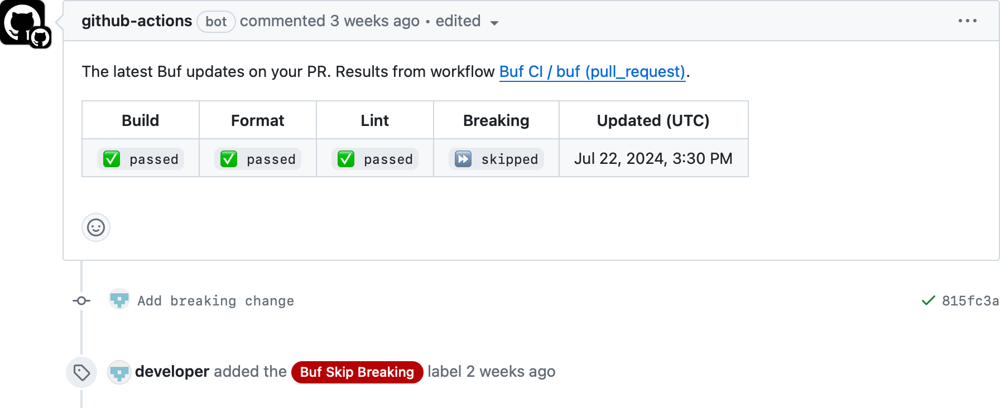

# buf-action

[][ci]
[][slack]

This GitHub action makes it easy to run [`buf`][buf] within a workflow to check for
[build](https://buf.build/docs/reference/cli/buf/build),
[lint](https://buf.build/docs/lint/overview),
[format](https://buf.build/docs/format/style),
and [breaking change](https://buf.build/docs/breaking/overview) errors,
as well as to automatically [publish schema changes](https://buf.build/docs/bsr/module/publish) to the [Buf Schema Registry (BSR)](https://buf.build/product/bsr).


## Usage

To use this action with the recommended default behavior, create a new `.github/workflows/buf-ci.yaml` file in your repository with the following content:

```yaml
name: Buf CI
on:
  push:
  pull_request:
    types: [opened, synchronize, reopened, labeled, unlabeled]
  delete:
permissions:
  contents: read
  pull-requests: write
jobs:
  buf:
    runs-on: ubuntu-latest
    steps:
      - uses: actions/checkout@v4
      - uses: bufbuild/buf-action@v1
        with:
          token: ${{ secrets.BUF_TOKEN }}
```

### Default behavior

When you push a Git commit, tag, or branch to GitHub, the action will [push named modules to the BSR](https://buf.build/docs/bsr/module/publish) using `buf push`.

On a pull request, the action will run all checks (using `buf build`, `buf lint`, `buf format`, `buf breaking`) and then post a [summary comment](#summary-comment) on the PR.

When you delete a Git branch or tag, the action will archive the corresponding label on the BSR.


### Configuration

To customize the behavior of the action, you can set the following parameters in the workflow file.
Add these parameters under the `with` section of the `uses` step in the workflow file.

```yaml
- uses: bufbuild/buf-action@v1
  with:
    ...
```

| Parameter                       | Description                                        | Default            |
|:--------------------------------|:---------------------------------------------------|:-------------------|
| `version`                       | Version of the `buf` CLI to use. | Latest [version][buf-releases] |
| `token`                         | API token for [logging into the BSR](https://buf.build/docs/bsr/authentication). | |
| `domain`                        | Domain for logging into the BSR, enterprise only.| `buf.build` |
| `input`                         | [Input](https://buf.build/docs/reference/inputs) for the `buf` command. | |
| `paths`                         | Limit to specific files or directories (separated by newlines). | |
| `exclude_imports`               | Exclude files imported by the target modules. | False |
| `exclude_paths`                 | Exclude specific files or directories, e.g. "proto/a/a.proto", "proto/a" (separated by newlines). | |
| `pr_comment`                    | Comment the results on the pull request. The workflow and job name combination must be unique. | Only on pull requests (non forks) |
| `format`                        | Whether to run the formatting step. | Runs on pushes to Git PR |
| `lint`                          | Whether to run the linting step. | Runs on pushes to Git PR |
| `breaking`                      | Whether to run the breaking change detection step. | Runs on pushes to Git PR |
| `breaking_against`              | [Input](https://buf.build/docs/reference/inputs) to compare against. | Base of the PR or the commit before the event |
| `push`                          | Whether to run the push step. | Runs on Git pushes (non forks) |
| `push_disable_create`           | Disables repository creation if it does not exist. | False |
| `archive`                       | Whether to run the archive step. | Runs on Git deletes (non forks) |
| `setup_only`                    | Setup only the `buf` environment, optionally logging into the BSR, but without executing other commands. | |
| `github_actor`                  | GitHub actor for API requests. | Actor from GitHub context |
| `github_token`                  | GitHub token for API requests. Ensures requests aren't rate limited | Token from GitHub context |
| `public_github_token`           | GitHub token for github.com. Must be set when running on a private GitHub Enterprise instance to authenticate requests, otherwise ignored. | |


### Skip the breaking change detection step

By default, the action runs the breaking change detection step on every pull request.
To skip this step, add the label `buf skip breaking` to the PR.



Ensure the workflow file includes the `pull_request` event types `labeled` and `unlabeled` so checks re-run on label changes.

To disable the ability to skip breaking change checks via a label, set the `breaking` parameter to the value `${{ github.event_name == 'pull_request' }}` so it runs on all PRs.
See [examples/disable-skip/buf-ci.yaml](examples/disable-skip/buf-ci.yaml) for an example.

### Disable steps

To disable parts of the workflow, each step corresponds to a boolean flag in the parameters.
For example to disable formatting set the parameter `format` to `false`:

```yaml
- uses: bufbuild/buf-action@v1
  with:
    format: false
```

See [action.yml](action.yml) for all available parameters.

### Versioning

For reproducible builds, you can pin to an explicit version of `buf` by setting `version`.

```yaml
- uses: bufbuild/buf-action@v1
  with:
    version: 1.50.1
```

If no version is specified in the workflow config, the action will resolve the version in order of precedence:
- A version specified in the environment variable `${BUF_VERSION}`.
- The version of `buf` that is already installed on the runner (if it exists).
- The latest version of the `buf` binary from the official releases on GitHub.

### Authentication

[Publishing schemas](https://buf.build/docs/bsr/module/publish) to the BSR provides a seamless
way for consumers of your APIs to generate code.
Authenticating with the BSR is required for both the push and archive label steps.

Generate a token from the [BSR UI](https://buf.build/docs/bsr/authentication#create-an-api-token) and add it to the [repository secrets](https://docs.github.com/en/actions/reference/encrypted-secrets).
To authenticate with the BSR, set the API token as the parameter `token`:

```yaml
- uses: bufbuild/buf-action@v1
  with:
    token: ${{ secrets.BUF_TOKEN }}
```

A post-action step will logout from the BSR to ensure the token is not stored in the `.netrc` file.
For more information on authentication, see the [BSR Authentication Reference](https://buf.build/docs/bsr/authentication).

### Summary comment

The action reports the status of the most recent checks in a comment on each pull request.


To disable the comment, set the parameter `comment` to `false` and remove the permission `pull_request: write` as this is no longer required.

```diff
name: Buf CI
on:
  push:
  pull_request:
    types: [opened, synchronize, reopened, labeled, unlabeled]
  delete:
permissions:
  contents: read
- pull-requests: write
jobs:
  buf:
    runs-on: ubuntu-latest
    steps:
      - uses: actions/checkout@v4
      - uses: bufbuild/buf-action@v1
        with:
          token: ${{ secrets.BUF_TOKEN }}
+         pr_comment: false
```

### Specify the input directory

To run the action for inputs not declared at the root of the repository,
set the parameter `input` to the directory of your `buf.yaml` file.

```yaml
- uses: bufbuild/buf-action@v1
  with:
    input: <path/to/module>
```

Breaking change detection by default will use the `input` value as a subdirectory for the breaking against value.
To customize this behavior, set the parameter `breaking_against` to the desired input.

```yaml
- uses: bufbuild/buf-action@v1
  with:
    input: <path/to/module>
    breaking_against: ${{ github.event.repository.clone_url }}#format=git,commit=${{ github.event.pull_request.base.sha }},subdir=<path/to/module>
```

Alternatively, you can checkout the base for the breaking comparison to a local folder
and then set the value of `breaking_against` to the path of the base.

```yaml
- uses: actions/checkout@v4
  with:
    path: head
- uses: actions/checkout@v4
  with:
    path: base
    ref: ${{ github.event.pull_request.base.sha }}
- uses: bufbuild/buf-action@v1
  with:
    input: head/<path/to/module>
    breaking_against: base/<path/to/module>
```

For more information on inputs, see the [Buf Inputs Reference](https://buf.build/docs/reference/inputs).

### Setup only

To only setup the action without running any commands, set the parameter `setup_only` to `true`.
This will install `buf` and optionally login to the schema registry but no additional commands will be run.
Subsequent steps will have `buf` available in their $PATH and can invoke `buf` directly.

```yaml
- uses: bufbuild/buf-action@v1
  with:
    setup_only: true
- run: buf build --error-format github-actions
```

See the [only-setup.yaml](examples/only-setup/buf-ci.yaml) example.

### Customize when steps run

To trigger steps on different events use the GitHub action context to deduce the event type.
For example to enable formatting checks on both pull requests and push create an expression for the parameter `format`:

```yaml
- uses: bufbuild/buf-action@v1
  with:
    format: ${{ contains(fromJSON('["push", "pull_request"]'), github.event_name) }}
```

See [GitHub Actions expressions](https://docs.github.com/en/actions/learn-github-actions/expressions) documentation.

### Skip checks if commit message matches a specific pattern

To conditionally run checks based on user input, use the GitHub action context to check for the contents of the commit.
For example to disable breaking change detection on commits, create an expression on the parameter `breaking` to check the contents of the commit message:

```yaml
- uses: bufbuild/buf-action@v1
  with:
    breaking: |
      contains(fromJSON('["push", "pull_request"]'), github.event_name) &&
      !contains(github.event.head_commit.message, 'buf skip breaking')
```

See [GitHub Actions job context](https://docs.github.com/en/actions/reference/context-and-expression-syntax-for-github-actions#job-context) documentation.

### Only push on changes to APIs

To push only on changes to when your module changes, restrict the push step for any changes to `buf` related files.
This can be achieved by using the `paths` filter on the `push` event.

```yaml
push:
  paths:
    - '**.proto'
    - '**/buf.yaml'
    - '**/buf.lock'
    - '**/buf.md'
    - '**/README.md'
    - '**/LICENSE'
```

See the [push-on-changes.yaml](examples/push-on-changes/buf-ci.yaml) example.

### Example workflows

Check out the [examples](examples) directory for more detailed workflows.

## Migrating from individual Buf actions

If you're currently using any of our individual actions
([buf-setup-action][buf-setup], [buf-breaking-action][buf-breaking], [buf-lint-action][buf-lint], [buf-push-action][buf-push]),
we recommend migrating to this consolidated action that has additional capabilities. Benefits to migrating include:
- Less configuration and setup, with built-in best practices.
- Enhanced integration with Git data when pushing to the BSR.
- Status comments on pull requests.
- Easy configuration for custom behavior.

See the [migration guide](MIGRATION.md) for more information.

## Debugging

To debug the action, rerun the workflow with debug logging enabled.
This will run all buf commands with the `--debug` flag.
See the [re-run jobs with debug logging](https://github.blog/changelog/2022-05-24-github-actions-re-run-jobs-with-debug-logging/) for more information.

## Feedback and support

If you have any feedback or need support, please reach out to us on the [Buf Slack][slack],
or [GitHub Issues](https://github.com/bufbuild/buf-action/issues).

## Status: stable

This action is stable and ready for production use.

## Legal

Offered under the [Apache 2 license][license].

[buf]: https://buf.build
[buf-setup]: https://github.com/marketplace/actions/buf-setup
[buf-breaking]: https://github.com/marketplace/actions/buf-breaking
[buf-cli]: https://github.com/bufbuild/buf
[buf-lint]: https://github.com/marketplace/actions/buf-lint
[buf-push]: https://github.com/marketplace/actions/buf-push
[buf-releases]: https://github.com/bufbuild/buf/releases
[ci]: https://github.com/bufbuild/buf-action/actions/workflows/ci.yaml
[license]: https://github.com/bufbuild/bufisk/blob/main/LICENSE
[slack]: https://buf.build/links/slack
[bsr]: https://buf.build/docs/introduction
[push-event]: https://docs.github.com/en/actions/using-workflows/events-that-trigger-workflows#push
[pull-request-event]: https://docs.github.com/en/actions/using-workflows/events-that-trigger-workflows#pull_request
[delete-event]: https://docs.github.com/en/actions/using-workflows/events-that-trigger-workflows#delete
