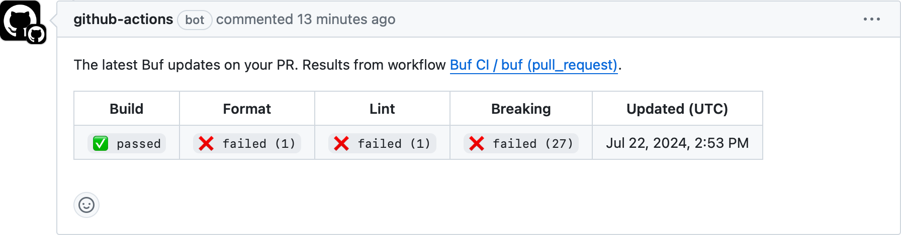

# buf-action

[][ci]
[][slack]

> [!CAUTION]
> This is in alpha and is under development, stay tuned!

This GitHub action makes it easy to run [`buf`][buf] within a workflow to check for
[build](https://buf.build/docs/reference/cli/buf/build),
[lint](https://buf.build/docs/lint/overview),
[format](https://buf.build/docs/format/style),
and [breaking change](https://buf.build/docs/breaking/overview) errors,
as well as to automatically [publish schema changes](https://buf.build/docs/bsr/module/publish) to the [Buf Schema Registry (BSR)](https://buf.build/product/bsr).


## Usage

To use this action with the recommended default behavior, create a new `.github/workflows/buf-ci.yaml` file in your repository with the following content:

```yaml
name: Buf CI
on:
  push:
  pull_request:
    types: [opened, synchronize, reopened, labeled, unlabeled]
  delete:
permissions:
  contents: read
  pull-requests: write
jobs:
  buf:
    runs-on: ubuntu-latest
    steps:
      - uses: actions/checkout@v4
      - uses: bufbuild/buf-action@v0.1
        with:
          username: ${{ secrets.BUF_USERNAME }}
          token: ${{ secrets.BUF_TOKEN }}
```

### Default behavior

The default behavior of this action is the recommended workflow for a GitHub repository that contains Protobuf files.

| GitHub action event | Default behavior | `buf` commands |
| - | - | - |
| [`push`][push-event] | Modules that are configured with a BSR name are [pushed to the BSR](https://buf.build/docs/bsr/module/publish) every time a new Git commit, tag, or branch is pushed to GitHub. | `buf push` |
| [`pull_request`][pull-request-event] | Run all checks and post (or update) a [summary comment](#summary-comment) on the PR every time the PR is updated. Errors are added as annotations on the PR. | `buf build`<br>`buf lint`<br>`buf format`<br>`buf breaking` |
| [`delete`][delete-event] | Archive the corresponding label on the BSR every time a Git branch or tag is deleted from GitHub. | `buf beta registry archive --label` |

### Configuration

To customize the behavior of the action, you can set the following inputs in the workflow file.
Add these inputs to the `with` section of the `uses` step in the workflow file.

```yaml

| Parameter                       | Description                                        | Default            |
|:--------------------------------|:---------------------------------------------------|:-------------------|
| `version`                       | Version of the `buf` CLI to use. | Latest [version][buf-releases] |
| `username`                      | Username for logging into the BSR. | |
| `token`                         | API token for logging into the BSR. | |
| `domain`                        | Domain for logging into the BSR, enterpise only.| `buf.build` |
| `setup_only`                    | Setup only the buf environment, optionally logging into the BSR, but without executing other commands. | |
| `pr_comment`                    | Comment the results on the pull request. | Only on pull requests |
| `input`                         | Input for the buf command. | |
| `paths`                         | Limit to specific files or directories (separated by newlines). | |
| `exclude_paths`                 | Exclude specific files or directories (separated by newlines). | |
| `exclude_imports`               | Exclude imports. | |
| `lint`                          | Whether to run the linting step. | Runs on pushes to Git PR |
| `format`                        | Whether to run the formatting step. | Runs on pushes to Git PR |
| `breaking`                      | Whether to run the breaking change detection step. | Runs on pushes to Git PR |
| `breaking_against`              | Input to compare against. | Base of the pull requests or the commit before the push event |
| `push`                          | Whether to run the push step. | Runs on Git pushes |
| `push_create`                   | Create the repository if it does not exist. | True |
| `push_create_visibility`        | Repository visibility setting if created. | Unset is equivelent to "private" |
| `push_labels`                   | Associate the labels with the pushed modules (separated by newlines). | |
| `push_git_metadta`              | Set additional git metadata on push. | True |
| `push_source_control_url`       | Set the source control URL for each pushed modules. | |
| `archive`                       | Whether to run the archive step. | Runs on Git deletes |
| `archive_labels`                | Labels to archive (separated by newlines), | |


### Skipping steps

The default configuration makes it possible to skip lint, formatting, or breaking change checks on a PR
by adding a label with a (case-insensitive) special name to that PR.

- `buf skip breaking`: skips breaking change detection.
- `buf skip lint`: skips lint.
- `buf skip format`: skips format. 

Ensure the workflow file includes the `pull_request` event types `labeled` and `unlabeled` so checks re-run on label changes.
To disable this behaviour, override the action inputs `breaking`, `lint`, and `format`.
See [examples/disable-skip/buf-ci.yaml](examples/disable-skip/buf-ci.yaml) for an example.

### Versioning

For reproducible builds, you can pin to an explicit version of `buf` by setting `version`.

```yaml
- uses: bufbuild/buf-action@v0.1
  with:
    version: 1.33.0
```

If no version is specified in the workflow config, the action will resolve the version in order of precendence:
- A version specified in the environment variable `${BUF_VERSION}`.
- The version of `buf` that is already installed on the runner (if it exists).
- The latest version of the `buf` binary from the official releases on GitHub.

### Authentication

[Publishing schemas](https://buf.build/docs/bsr/module/publish) to the Buf Schema Registry (BSR) provides a seamless
way for consumers of your APIs to generate code.
Authenticating with the BSR is required for both the push and archive label steps.

To authenticate with the BSR, set the inputs `username` and `token`.
The `username` and `token` values should be
[stored as secrets in the repository settings](https://docs.github.com/en/actions/security-guides/using-secrets-in-github-actions).
The `token` value can be [generated from the Buf Schema Registry UI](https://buf.build/docs/bsr/authentication#create-an-api-token).

```yaml
- uses: bufbuild/buf-action@v0.1
  with:
    username: ${{ secrets.BUF_USERNAME }}
    token: ${{ secrets.BUF_TOKEN }}
```

For more information on authentication, see the [Buf Schema Registry Authentication Reference](https://buf.build/docs/bsr/authentication).

### Summary comment

The action reports the status of the most recent checks in a comment on each pull request.



To disable the comment, set the input `comment` to `false` and remove the permission `pull_request: write` as this is no longer required.

```diff
name: Buf CI
on:
  push:
  pull_request:
    types: [opened, synchronize, reopened, labeled, unlabeled]
  delete:
permissions:
  contents: read
- pull-requests: write
jobs:
  buf:
    runs-on: ubuntu-latest
    steps:
      - uses: actions/checkout@v4
      - uses: bufbuild/buf-action@v0.1
        with:
          username: ${{ secrets.BUF_USERNAME }}
          token: ${{ secrets.BUF_TOKEN }}
+         comment: false
```

### Specify input directory

To run the action for inputs not specified at the root of the repository,
set the input `input` to the path of your `buf.yaml` directory.

Breaking change detection will also need to be configured with the correct value for `breaking_against`.
If you are using a URL, add the `subdir` parameter to match `input`.

```yaml
- uses: bufbuild/buf-action@v0.1
  with:
    input: protos
    breaking_against: |
      ${{ github.event.repository.clone_url }}#format=git,commit=${{ github.event.pull_request.base.sha }},subdir=protos
```

Alternatively, you can checkout the base for the breaking comparison to a local folder
and then set the value of `breaking_against` to point to that local folder.

```yaml
- uses: actions/checkout@v4
  with:
    path: head
- uses: actions/checkout@v4
  with:
    path: base
    ref: ${{ github.event.pull_request.base.sha }}
- uses: bufbuild/buf-action@v0.1
  with:
    input: head/protos
    breaking_against: base/protos
```

For more information on inputs, see the [Buf Inputs Reference](https://buf.build/docs/reference/inputs).

### Setup only

To only setup the action without running any commands, set the input `setup_only` to `true`.
This will install `buf` and optionally login to the schema registry but no additional commands will be run.
Subsequent steps will have `buf` available in their $PATH and can invoke `buf` directly.

```yaml
- uses: bufbuild/buf-action@v0.1
  with:
    setup_only: true
- run: buf build --error-format github-actions
```

See the [only-setup.yaml](examples/only-setup/buf-ci.yaml) example.

### Skip steps

To skip or disable parts of the workflow, each step corresponds to a boolean flag in the input.
For example to disable formatting set the input `format` to `false`:

```yaml
- uses: bufbuild/buf-action@v0.1
  with:
    format: false
```

See [action.yml](action.yml) for all available inputs.

### Customize when steps run

To trigger steps on different events use the GitHub action context to deduce the event type.
For example to enable formatting checks on both pull requests and push create an expression for the input `format`:

```yaml
- uses: bufbuild/buf-action@v0.1
  with:
    format: ${{ contains(fromJSON('["push", "pull_request"]'), github.event_name) }}
```

See [GitHub Actions expressions](https://docs.github.com/en/actions/learn-github-actions/expressions) documentation.

### Skip checks on commit messages

To conditionally run checks based on user input, use the GitHub action context to check for the contents of the commit.
For example to disable breaking change detection on commits, create an expression on the input `breaking` to check the contents of the commit message:

```yaml
- uses: bufbuild/buf-action@v0.1
  with:
    breaking: |
      contains(fromJSON('["push", "pull_request"]'), github.event_name) &&
      !contains(github.event.head_commit.message, 'buf skip breaking')
```

See [GitHub Actions job context](https://docs.github.com/en/actions/reference/context-and-expression-syntax-for-github-actions#job-context) documentation.

### Only push on changes

To push only on changes to the protos, restrict the push step for any changes to buf releated files.
This can be achieved by using the `paths` filter on the `push` event.

```yaml
push:
  paths:
    - '**.proto'
    - '**/buf.yaml'
    - '**/buf.lock'
    - '**/buf.md'
    - '**/README.md'
    - '**/LICENSE'
```

See the [push-on-changes.yaml](examples/push-on-changes/buf-ci.yaml) example.

### Verify generated files are up-to-date

If your project uses local code generation, we recommend checking for diffs on pull requests.
This isn't available as a built-in step because generating code may require manual setup, but can easily be added by invoking `buf`.

To check that generated files match committed protobuf files, run the `buf generate` command and then `git diff`.
If differences exist, `git diff` returns a non-zero exit code with the `--exit-code` flag.

```yaml
- name: Run buf generate
  run: |
    buf generate --error-format github-actions
    git diff --exit-code gen
```

#### Builtin protoc plugins

Some projects require the use of builtin `protoc` plugins, such as `protoc-gen-cpp`.
To use these plugins, please additionaly install `protoc` such as with the action
[`setup-protoc`](https://github.com/marketplace/actions/setup-protoc).

### Example workflows

Check out the [examples](examples) directory for more detailed workflows.

## Migrating from individual Buf actions

If you're currently using any of our individual actions
([buf-setup-action][buf-setup], [buf-breaking-action][buf-breaking], [buf-lint-action][buf-lint], [buf-push-action][buf-push]),
we recommend migrating to this consolidated action that has additional capabilities. Benefits to migrating include:
- Less configuration and setup, with built-in best practices.
- Enhanced integration with Git data when pushing to the Buf Schema Registry (BSR).
- Status comments on pull requests.
- Easy configuration for custom behavior.

## Feedback and support

If you have any feedback or need support, please reach out to us on the [Buf Slack][slack],
or [GitHub Issues](https://github.com/bufbuild/buf-action/issues).

## Status: alpha

Not yet stable.

## Legal

Offered under the [Apache 2 license][license].

[buf]: https://buf.build
[buf-setup]: https://github.com/marketplace/actions/buf-setup
[buf-breaking]: https://github.com/marketplace/actions/buf-breaking
[buf-cli]: https://github.com/bufbuild/buf
[buf-lint]: https://github.com/marketplace/actions/buf-lint
[buf-push]: https://github.com/marketplace/actions/buf-push
[buf-releases]: https://github.com/bufbuild/buf/releases
[ci]: https://github.com/bufbuild/buf-action/actions/workflows/ci.yaml
[license]: https://github.com/bufbuild/bufisk/blob/main/LICENSE
[slack]: https://buf.build/links/slack
[bsr]: https://buf.build/docs/introduction
[push-event]: https://docs.github.com/en/actions/using-workflows/events-that-trigger-workflows#push
[pull-request-event]: https://docs.github.com/en/actions/using-workflows/events-that-trigger-workflows#pull_request
[delete-event]: https://docs.github.com/en/actions/using-workflows/events-that-trigger-workflows#delete
